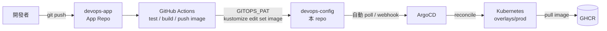

# devops-config

`devops-app` 的 GitOps Repo。只放 Kubernetes 期望狀態（Kustomize manifests），不放程式碼、不放 CI。

配對關係：[`devops-app`](https://github.com/Graylee0128/devops-app)（App Repo，程式碼 + CI）→ 這個 repo（Config Repo，Kubernetes desired state）→ ArgoCD → 叢集。

## 架構



**CI 只改這個 repo 的 YAML，不會直接碰叢集。** 真正把 YAML 變成叢集狀態的是 ArgoCD，這條路徑上唯一持有叢集憑證的是 ArgoCD 自己。


## 目錄結構

```text
base/                    # 共用基底：Deployment / Service / Ingress
  deployment.yaml
  service.yaml
  ingress.yaml
  kustomization.yaml
overlays/dev/             # namespace devops-app-dev，1 replica，image tag 手動釘選
  kustomization.yaml
  patch-ingress.yaml
  patch-resources.yaml
overlays/prod/            # namespace devops-app-prod，3 replicas，image tag 由 CI 自動 bump
  kustomization.yaml
  patch-ingress.yaml
  patch-antiaffinity.yaml
  pdb.yaml
argocd/
  application.yaml        # 指向 overlays/prod，automated prune+selfHeal
```

`dev` 手動釘選 tag、`prod` 由 CI 自動 bump，刻意做成一組對照：自動化路徑跟人工路徑並存，也避免一次 push 同時動兩個環境。

## Probe 設計依據

| Probe | 打哪個 endpoint | 失敗後果 | 檢查範圍 |
|---|---|---|---|
| `startupProbe` | `/livez` | 成功前凍結另外兩個 probe | cold start，容忍上限 `failureThreshold × periodSeconds` = 30×2 = 60s |
| `livenessProbe` | `/livez` | kubelet 重啟容器 | process 存活 |
| `readinessProbe` | `/readyz` | 移出 Service Endpoints，不重啟 | 檢查依賴/暖機狀態 |

最容易踩的坑：**liveness 檢查資料庫等下游依賴**——下游一抖動，全部 Pod 同時被判定「壞掉」而重啟，小故障放大成雪崩。這裡刻意讓 liveness 只問自己活著沒有，依賴類檢查全部放 readiness。

## Resources 設計依據

```yaml
requests: { cpu: 10m, memory: 32Mi }
limits:   { cpu: 200m, memory: 64Mi }
```

`requests` 決定排程（scheduler 依此選 node），`limits` 決定執行期 cgroup 強制上限。超標後果不對稱：**Memory 超過 limit 直接 OOMKilled；CPU 超過 limit 只是 throttling，不會被殺。**

**實測**（`kubectl top pod -n devops-app-prod`，3 副本閒置狀態）：

```text
devops-app-747f949788-gltcb   1m   3Mi
devops-app-747f949788-k5vkc   1m   3Mi
devops-app-747f949788-vgsxc   1m   3Mi
```

節點整體：`312m CPU (5%)` / `1811Mi (15%)`。

Go 的 heap 會隨 GC 週期起伏，啟動瞬間也比穩態高，requests 壓到貼齊閒置值等於把每次 GC 或流量進來都變成排程壓力。這裡取約 10 倍餘裕（`10m/32Mi`），memory limit 設 `64Mi`（request 的 2 倍）——**memory 超標是直接 OOMKilled，餘裕要留得比 CPU 大方**。


## 其他決定

| 決定 | 理由 |
|---|---|
| Service 用 named port（`targetPort: http`） | 容器 port 改變時 Service 不用跟著改。 |
| `Application` 保留 `resources-finalizer.argocd.argoproj.io` | 刪 Application 時連帶清資源，不留孤兒。風險：若 ArgoCD 已被移除而 finalizer 還在，Application 會卡在 `Terminating`。 |

## 驗證方式

```bash
kubectl kustomize overlays/dev    # 檢查 patch 有沒有正確套上、image tag 對不對
kubectl kustomize overlays/prod
```

## 實作心得與挑戰

這次最花時間的三個坑，都不在「Kubernetes YAML 怎麼寫」，而在**判斷問題出在哪一層**。

### 坑一：需要先清理環境

機器上有未清理的pods, containers

| 項目 | 我以為 | 實測 |
|---|---|---|
| 叢集類型 | minikube | **k3s**（`v1.34.6+k3s1`） |
| 節點數 | 1 | **2**，其中一個 `NotReady` 已達 **145 天** |
| ArgoCD | 正常運作 | **半殭屍**：`repo-server` `0/1`，多個 Pod 卡在 `Terminating` 逾 100 天 |
| ArgoCD 在管什麼 | 這次的專案 | 一個**完全無關的舊專案**，因 repo-server 掛掉而 `connection refused` |

決定整套清掉重來，而不是在殘骸上疊新東西。

**為什麼選 kind**

被清掉的環境正是 k3s，而它出問題的方式恰好來自它的設計取向：裝成 systemd 系統服務、長期常駐、預裝 Traefik 長期佔著 80/443、卸載要專門腳本、幽靈節點放了 145 天沒人發現。

kind 的取向剛好相反 —— **每個「節點」只是一個 Docker container**，`kind delete cluster` 一次清空，不在系統層留下任何痕跡。對「隨時要能重建、重建要能一致」的評測環境，這個特性比功能多寡重要。

代價也很清楚：kind 幾乎什麼都不預裝（ingress controller、metrics-server 都要自己來），但這反而讓每個元件都是自己有意識裝上去的。

**Port 衝突：不能假設 80/443 是空的**

機器上有現役的正式服務（對外經 Cloudflare tunnel）佔著 80/443，判定不可停用。因此 kind 的 ingress 對外改綁 **8080/8443**：

```yaml
extraPortMappings:
- containerPort: 80
  hostPort: 8080      # 避開主機上現役服務
- containerPort: 443
  hostPort: 8443
```

後來換到另一台主機重建時，80/443 一樣被佔用，但**佔用者完全不同**（一個排程系統與一套資安監控平台）。這件事本身就是個教訓：**佔用者會變，每次都要重查 `ss -tln`，不能照抄上次的結論。** 而 `hostPort: 8080/8443` 這個設計因為一開始就是為了「避開未知佔用者」，換機器完全不用改。

**換機器後，環境又一次跟預期不符**

原本的連線 IP 一直逾時，換另一條路徑（不同 hostname 與 port）才連上 —— **IP 不通不等於主機掛了**，可能只是那條路由斷線。

連上後才發現：`kubectl` 的 context 指向一個連不到的 minikube，`kind` 和 `kustomize` 兩個指令根本沒裝。**同一台主機不代表環境沒變過**，連線成功之後要先核對「這是不是我以為的那個環境」，不能假設狀態延續。

**資源限制：一個 host 層級的設定，炸掉三個看似無關的元件**

叢集建起來了，但 `kube-proxy` 反覆 CrashLoop，同時 ingress-nginx 的 controller 卡在 `ContainerCreating`、admission job 一直 `Error`。表面上像是 ingress-nginx 裝壞了。

實際上 `kube-proxy` 的 log 只有一行：`too many open files`。

追下去是 host 的 `fs.inotify.max_user_instances` 預設只有 **128**，而這台機器同時跑著十幾個其他 container，inotify 額度早就被瓜分光，kind 節點內的元件拿不到足夠配額：

```text
inotify 額度不足
   → kube-proxy CrashLoop
   → Service ClusterIP 的 iptables 規則沒建立
   → 任何 Pod 打 10.96.0.1（K8s API 的 ClusterIP）都逾時
   → ingress-nginx 的 admission job 拿不到 secret
   → controller 掛載 webhook-cert 失敗，卡在 ContainerCreating
```

查到 kind 官方 Known Issues 確認是已知問題，調高限制並寫進 `/etc/sysctl.conf` 後重建叢集，`kube-proxy` 與 `coredns` 都是 `1/1 Running`、0 重啟：

```bash
sudo sysctl -w fs.inotify.max_user_watches=524288
sudo sysctl -w fs.inotify.max_user_instances=512
```

**這一整段帶走的原則**

- 在共用機器上建叢集，**先稽核再動手**。假設幾乎一定有一項是錯的，而且錯的那項通常最貴。
- 工具選型可以（也應該）由「上一次為什麼壞掉」推導出來，而不是比較功能表。
- **不要假設 port、context、已安裝工具的狀態**，每次重查。
- 遇到「一堆不相干元件同時壞」，先往 **host 層級資源配額**想（inotify / fd / memory），不要從 YAML 開始猜。`kube-proxy` 是整個 Service 路由的基礎，它掛掉會偽裝成各種看起來無關的症狀。

### 坑二：把平台故障誤判成自己的程式錯誤

**現象**：App Repo 推上 `main` 兩次，Actions 顯示 `There are no workflow runs yet`，`total_count: 0`。

**排查（由外而內，先別動 YAML）**：

```bash
gh api repos/O/R/actions/runs --jq .total_count   # 0
gh api repos/O/R/actions/workflows                # active
gh api repos/O/R/actions/permissions              # enabled:true
gh api repos/O/R                                  # public / 非 fork / 未停用
gh api repos/O/R/contents/.github/workflows/ci.yml # 與本機一致
```

全部正常。找對照組——同帳號另一 repo 當天有跑成功，排除帳號層級問題。

隔幾分鐘 run 才出現（**Actions 建立 run 有數分鐘延遲**），狀態 `startup_failure`，`check-runs`/`check-suites`/`gh run view` 都拿不到錯誤訊息，只有網頁 Annotations 有一段帶 request ID 的內部錯誤。

**根因**：`githubstatus.com` 顯示 Actions `major_outage`（資料庫 primary 故障切換），同時 Git Operations / API / Webhooks / Packages 都 `operational`——GitHub 服務是切分的，push 成功不代表 CI 會跑。

**帶走的原則**：

- `startup_failure` 且 job 數為 0，可能是 workflow 無效，也可能是平台問題，不要預設是自己寫錯。
- 判斷「自己 vs 平台」最快方法：找對照組（同帳號另一 repo 當天是否成功）。
- 平台內部錯誤只在網頁 Annotations，REST API 拿不到，排查要涵蓋 UI。
- 故障期間停止重試，改做不依賴該服務的工作，等恢復後再驗證。

### 坑三：從單 Repo 換成雙 Repo，多出來的那把鑰匙

寫在單一 repo 時 CI 靠內建 `GITHUB_TOKEN` 就能改自己 repo，不用管憑證。這次 App Repo 與 GitOps Repo 分離，CI 跨 repo 寫入直接 403：

```text
CI 在 devops-app 執行 → 要寫入 devops-config → 403
```

**關鍵認知**：`GITHUB_TOKEN` 作用域被硬鎖在當前 repo，`permissions:` 無法放寬到別的 repo，跨 repo 寫入沒有參數能繞，只能自己管一組跨 repo 憑證。

**做法**：

1. fine-grained PAT，只授 `devops-config` 的 `Contents: Read and write`
2. 不給 `Workflows` 權限（能改 `.github/workflows/` 等於提權，`bump-manifest` 用不到）
3. 存成 App Repo 的 secret `GITOPS_PAT`
4. `bump-manifest` job 用它 checkout GitOps Repo、`kustomize edit set image`、commit push

**Secret 放 App Repo 而非 GitOps Repo**：信任方向單向——是 App Repo 要去寫別人；GitOps Repo 不需要任何憑證，因為 ArgoCD 是拉的，叢集憑證不必外流到 CI。

| | 單 Repo | 雙 Repo（本次） |
|---|---|---|
| 跨 repo 憑證 | 不需要 | 要自己建、自己管到期 |
| CI 迴圈風險 | 需 `paths-ignore` + `[skip ci]` 兩層防護 | 天然不會——commit 落在另一個 repo |
| Git history 語意 | 程式與部署變更混在同一條時間線 | 分開 |
| 上手成本 | 低 | 高（多一組 repo、一把 token、一個心智模型） |

**維運負擔**：PAT 90 天到期，到期當天 CI 突然 403 但錯誤訊息不會說是過期，容易誤判成權限設錯——到期日要排進行事曆。正式環境更好做法：GitHub App（短期自動輪替）或 ArgoCD Image Updater（免跨 repo 憑證）。

### 其他坑

- **ArgoCD 官方安裝檔會 apply 失敗**：`ApplicationSet` CRD 內嵌完整 OpenAPI schema，超過 API server 對 annotation 的 256KiB 上限。原因是 `kubectl apply` 預設走 client-side apply，會把整份 manifest 存進 `last-applied-configuration` annotation。解法是 `--server-side --force-conflicts`，改由 `managedFields` 追蹤欄位歸屬。
- **CI 紅燈不等於什麼都沒發生**：某次 run 整體 `failure`，但 image 其實已推送成功、GitOps Repo 也已被 bump —— 失敗的只有平行的掃描 job（action tag 少了 `v` 前綴而解析不到）。排查要看到 **job 層級**，不能只看 run 的紅綠燈。

## 限制

- 尚無 HPA；若導入，需同時在 `argocd/application.yaml` 加上 `ignoreDifferences` 忽略 `spec.replicas`（見「HPA / selfHeal 衝突」）。