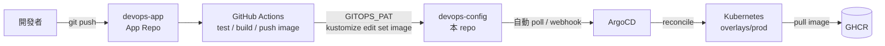

# devops-config

`devops-app` 的 GitOps Repo。只放 Kubernetes 期望狀態（Kustomize manifests），不放程式碼、不放 CI。

配對關係：[`devops-app`](https://github.com/Graylee0128/devops-app)（App Repo，程式碼 + CI）→ 這個 repo（Config Repo，Kubernetes desired state）→ ArgoCD → 叢集。

## 架構



**CI 只改這個 repo 的 YAML，不會直接碰叢集。** 真正把 YAML 變成叢集狀態的是 ArgoCD，這條路徑上唯一持有叢集憑證的是 ArgoCD 自己。

## 為什麼是 Pull（ArgoCD）不是 Push（CI 直接 kubectl apply）

| | Push（CI 直接 apply） | Pull（ArgoCD） |
|---|---|---|
| 叢集憑證放哪 | CI runner（外部系統） | 叢集內部 |
| 誰能看到「現在真的長怎樣」 | 沒人，Git 跟叢集可能早就對不上 | ArgoCD 持續 diff，`OutOfSync` 一眼看出 |
| 有人手動 `kubectl edit` 改叢集 | 不會被發現 | `selfHeal: true` 自動拉回 Git 狀態 |

核心論點：**叢集憑證不必外流到 CI 系統**。CI 只需要一把能寫 Git 的 token（見下方 App Repo 側的 `GITOPS_PAT`），不需要 kubeconfig。

## 為什麼 App/Config 分兩個 repo

- App Repo 的 commit = 「程式怎麼改」；Config Repo 的 commit = 「Production 怎麼改」，兩條時間線語意不同，混在一起會讓 Git history 失去意義。
- Config Repo 的 git history 本身就是 deployment history：`git revert` 一個 commit，ArgoCD 自動 reconcile 回去，不用另外維護「上一版是什麼」的紀錄。
- 代價：manifest commit（CI 寫回的 image tag）不會回頭觸發 App Repo 的 CI，但也因此不會有「commit 觸發自己」的迴圈問題；換來的是要自己管一把跨 repo 憑證（`GITOPS_PAT`，Contents 讀寫、鎖定這個 repo、90 天到期，細節見 App Repo 的 CI workflow）。

## 目錄結構

```text
base/                    # 共用基底：Deployment / Service / Ingress
  deployment.yaml
  service.yaml
  ingress.yaml
  kustomization.yaml
overlays/dev/             # namespace devops-app-dev，1 replica，image tag 手動釘選
  kustomization.yaml
  patch-ingress.yaml
  patch-resources.yaml
overlays/prod/            # namespace devops-app-prod，3 replicas，image tag 由 CI 自動 bump
  kustomization.yaml
  patch-ingress.yaml
  patch-antiaffinity.yaml
  pdb.yaml
argocd/
  application.yaml        # 指向 overlays/prod，automated prune+selfHeal
```

`dev` 手動釘選 tag、`prod` 由 CI 自動 bump，刻意做成一組對照：自動化路徑跟人工路徑並存，也避免一次 push 同時動兩個環境。

## Probe 設計依據

三個 probe 語意刻意分離，不共用同一個檢查邏輯：

| Probe | 打哪個 endpoint | 失敗後果 | 檢查範圍 |
|---|---|---|---|
| `startupProbe` | `/livez` | 成功前凍結另外兩個 probe | 只管冷啟期，容忍上限 `failureThreshold × periodSeconds` = 30×2 = 60s |
| `livenessProbe` | `/livez` | kubelet 重啟容器 | 只問 process 存活，**絕不檢查外部依賴** |
| `readinessProbe` | `/readyz` | 移出 Service Endpoints，不重啟 | 可以檢查依賴/暖機狀態 |

最容易踩的坑：**liveness 檢查資料庫等下游依賴**——下游一抖動，全部 Pod 同時被判定「壞掉」而重啟，小故障放大成雪崩。這裡刻意讓 liveness 只問自己活著沒有，依賴類檢查全部放 readiness。

## Resources 設計依據

```yaml
requests: { cpu: 10m, memory: 32Mi }
limits:   { cpu: 200m, memory: 64Mi }
```

`requests` 決定排程（scheduler 依此選 node），`limits` 決定執行期 cgroup 強制上限。超標後果不對稱：**Memory 超過 limit 直接 OOMKilled；CPU 超過 limit 只是 throttling，不會被殺。**

目前數字是佔位值，尚未用 `kubectl top pod` 實測回填（見下方「已知限制」）。

## HPA / selfHeal 衝突（刻意的設計選擇）

`replicas` 沒有寫在 `base/deployment.yaml`，而是各 overlay 用 kustomization 的 `replicas:` 欄位覆寫。原因：

**若日後導入 HPA，必須把 Deployment 的 `replicas` 欄位整個從 manifest 拿掉**，否則會形成無限迴圈：

```text
HPA 依負載把 replicas 調高
       ↓
ArgoCD 發現 Live State ≠ Git 宣告的 replicas
       ↓
selfHeal: true 把 replicas 調回 Git 的值
       ↓
HPA 再次調高 ……
```

ArgoCD 對此有官方作法（`ignoreDifferences` 忽略 `spec.replicas` 欄位），本專案目前沒有 HPA，先用「replicas 集中在 overlay、語意清楚」處理，等真的導入 HPA 再補上 `ignoreDifferences`。

## 其他設計決定

| 決定 | 理由 |
|---|---|
| `base/kustomization.yaml` 不用 `labels`/`commonLabels` transformer | `includeSelectors: true` 會改寫 `Deployment.spec.selector`，該欄位 immutable，之後調標籤只能砍掉重建。標籤改在各 manifest 內明寫。 |
| Service 用 named port（`targetPort: http`） | 容器 port 改變時 Service 不用跟著改。 |
| prod 的 `topologySpreadConstraints` 用 `ScheduleAnyway` 不用 `DoNotSchedule` | 單節點 kind 叢集只有一個 node，硬性約束會讓 3 個副本裡有 2 個永遠 `Pending`。正式多節點環境才該改成硬性約束。 |
| `PodDisruptionBudget` `minAvailable: 2` | 3 副本保底 2 個。**只擋自願中斷**（node drain），擋不住 OOMKill 或節點當機。 |
| Namespace 不寫成 manifest，改用 ArgoCD `syncOptions: CreateNamespace=true` | kustomize 的 `namespace:` transformer 會連帶改寫 Namespace 物件自己的 `metadata.name`，容易搞混。 |
| `Application` 保留 `resources-finalizer.argocd.argoproj.io` | 刪 Application 時連帶清資源，不留孤兒。風險：若 ArgoCD 已被移除而 finalizer 還在，Application 會卡在 `Terminating`。 |

## 驗證方式

```bash
kubectl kustomize overlays/dev    # 檢查 patch 有沒有正確套上、image tag 對不對
kubectl kustomize overlays/prod
```

## 已知限制

- `resources.requests/limits` 是佔位值，待用 `kubectl top pod` 實測 RSS/CPU 後回填。
- `kustomize build` 語意驗證（patch 是否正確套用）尚未在目標叢集上跑過，待遠端主機 SSH 連線恢復。
- 尚無 HPA；若導入，需同時在 `argocd/application.yaml` 加上 `ignoreDifferences` 忽略 `spec.replicas`（見上方「HPA / selfHeal 衝突」）。
